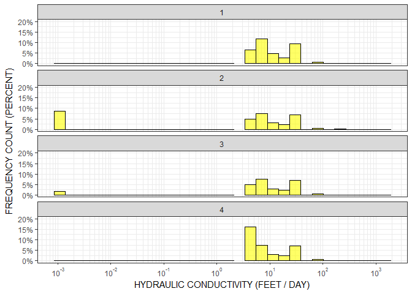
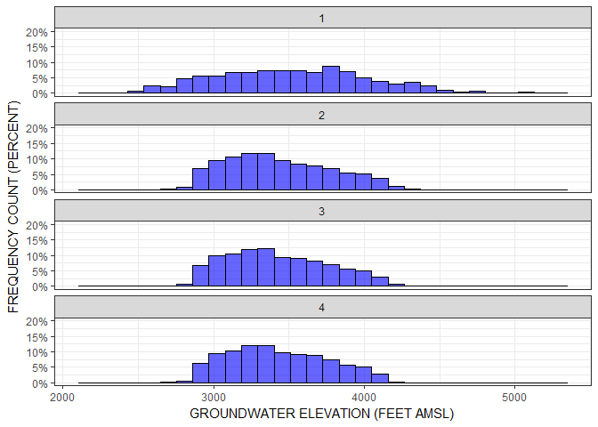

MFtools README
================
Dan Puddephatt
2017-01-25

The MFtools library is used for investigating the input and output ffiles from MODFLOW simulations. The library is based on fixed-width file formats as are generated when using Groundwater Vistas. This library has been tested using Groundwater Vistas files. The library includes functions for the following tasks:

-   Reading the discritization file (readdis(rootname))
-   Reading the layer property flow file (readlpf(rootname))
-   Reading the basic transport package file (readbtn(rootname))
-   Reading the headsave file (readhds(rootname, NLAY, NTTS))
-   Reading the unformatted concentration file (readucn(ucrootname, NLAY, NTTS))
-   Reading no-flow array file (readnoflow(FILE, rootname))
-   Writing the unformatted concentration file based on a concentration dataframe (writeucn(ucn, ofl))

The library also includes a utility function for calculating contaminant mass based on information from the headsave file (i.e., saturated thickness), porosity read from the basic transport package, and concentrations from the unformatted concentration file (masscalc(BTN, HDS, UCN))

The package includes a set of MODFLOW files from the Texas Water Development Board (TWDB) Groundwater Availability Model (GAM) for the Edwards-Trinity (High Plains) Aquifer in Texas and New Mexico.

The functions from the MFtools library use rootnames to read files. Rootnames are based on the MODFLOW rootname convention such that files consist of a rootname and an extension that describes the MODFLOW file.

For the example using the TWDB GAM the rootname can be identified as follows (NOTE that by my personal convention my script headings include the libraries that I will be using):

``` r
library(MFtools)
library(tidyverse)
library(magrittr)
library(scales)
rnm <- system.file("extdata", "Ogll_sv2.01_ss.dis", package = "MFtools") %>%
        tools::file_path_sans_ext()
```

With the rootname we can now read in the discretization file

``` r
d <- readdis(rnm)
d
```

    ## $NLAY
    ## [1] 4
    ## 
    ## $NCOL
    ## [1] 290
    ## 
    ## $NROW
    ## [1] 270
    ## 
    ## $NPER
    ## [1] 20
    ## 
    ## $ITMUNI
    ## [1] 4
    ## 
    ## $LENUNI
    ## [1] 1
    ## 
    ## $LAYCBD
    ## [1] 0 0 0 0
    ## 
    ## $dX
    ##   [1] 5280 5280 5280 5280 5280 5280 5280 5280 5280 5280 5280 5280 5280 5280
    ##  [15] 5280 5280 5280 5280 5280 5280 5280 5280 5280 5280 5280 5280 5280 5280
    ##  [29] 5280 5280 5280 5280 5280 5280 5280 5280 5280 5280 5280 5280 5280 5280
    ##  [43] 5280 5280 5280 5280 5280 5280 5280 5280 5280 5280 5280 5280 5280 5280
    ##  [57] 5280 5280 5280 5280 5280 5280 5280 5280 5280 5280 5280 5280 5280 5280
    ##  [71] 5280 5280 5280 5280 5280 5280 5280 5280 5280 5280 5280 5280 5280 5280
    ##  [85] 5280 5280 5280 5280 5280 5280 5280 5280 5280 5280 5280 5280 5280 5280
    ##  [99] 5280 5280 5280 5280 5280 5280 5280 5280 5280 5280 5280 5280 5280 5280
    ## [113] 5280 5280 5280 5280 5280 5280 5280 5280 5280 5280 5280 5280 5280 5280
    ## [127] 5280 5280 5280 5280 5280 5280 5280 5280 5280 5280 5280 5280 5280 5280
    ## [141] 5280 5280 5280 5280 5280 5280 5280 5280 5280 5280 5280 5280 5280 5280
    ## [155] 5280 5280 5280 5280 5280 5280 5280 5280 5280 5280 5280 5280 5280 5280
    ## [169] 5280 5280 5280 5280 5280 5280 5280 5280 5280 5280 5280 5280 5280 5280
    ## [183] 5280 5280 5280 5280 5280 5280 5280 5280 5280 5280 5280 5280 5280 5280
    ## [197] 5280 5280 5280 5280 5280 5280 5280 5280 5280 5280 5280 5280 5280 5280
    ## [211] 5280 5280 5280 5280 5280 5280 5280 5280 5280 5280 5280 5280 5280 5280
    ## [225] 5280 5280 5280 5280 5280 5280 5280 5280 5280 5280 5280 5280 5280 5280
    ## [239] 5280 5280 5280 5280 5280 5280 5280 5280 5280 5280 5280 5280 5280 5280
    ## [253] 5280 5280 5280 5280 5280 5280 5280 5280 5280 5280 5280 5280 5280 5280
    ## [267] 5280 5280 5280 5280 5280 5280 5280 5280 5280 5280 5280 5280 5280 5280
    ## [281] 5280 5280 5280 5280 5280 5280 5280 5280 5280 5280
    ## 
    ## $dY
    ##   [1] 5280 5280 5280 5280 5280 5280 5280 5280 5280 5280 5280 5280 5280 5280
    ##  [15] 5280 5280 5280 5280 5280 5280 5280 5280 5280 5280 5280 5280 5280 5280
    ##  [29] 5280 5280 5280 5280 5280 5280 5280 5280 5280 5280 5280 5280 5280 5280
    ##  [43] 5280 5280 5280 5280 5280 5280 5280 5280 5280 5280 5280 5280 5280 5280
    ##  [57] 5280 5280 5280 5280 5280 5280 5280 5280 5280 5280 5280 5280 5280 5280
    ##  [71] 5280 5280 5280 5280 5280 5280 5280 5280 5280 5280 5280 5280 5280 5280
    ##  [85] 5280 5280 5280 5280 5280 5280 5280 5280 5280 5280 5280 5280 5280 5280
    ##  [99] 5280 5280 5280 5280 5280 5280 5280 5280 5280 5280 5280 5280 5280 5280
    ## [113] 5280 5280 5280 5280 5280 5280 5280 5280 5280 5280 5280 5280 5280 5280
    ## [127] 5280 5280 5280 5280 5280 5280 5280 5280 5280 5280 5280 5280 5280 5280
    ## [141] 5280 5280 5280 5280 5280 5280 5280 5280 5280 5280 5280 5280 5280 5280
    ## [155] 5280 5280 5280 5280 5280 5280 5280 5280 5280 5280 5280 5280 5280 5280
    ## [169] 5280 5280 5280 5280 5280 5280 5280 5280 5280 5280 5280 5280 5280 5280
    ## [183] 5280 5280 5280 5280 5280 5280 5280 5280 5280 5280 5280 5280 5280 5280
    ## [197] 5280 5280 5280 5280 5280 5280 5280 5280 5280 5280 5280 5280 5280 5280
    ## [211] 5280 5280 5280 5280 5280 5280 5280 5280 5280 5280 5280 5280 5280 5280
    ## [225] 5280 5280 5280 5280 5280 5280 5280 5280 5280 5280 5280 5280 5280 5280
    ## [239] 5280 5280 5280 5280 5280 5280 5280 5280 5280 5280 5280 5280 5280 5280
    ## [253] 5280 5280 5280 5280 5280 5280 5280 5280 5280 5280 5280 5280 5280 5280
    ## [267] 5280 5280 5280 5280
    ## 
    ## $TOP
    ## # A tibble: 78,300 × 5
    ##      ROW   COL     X       Y    TOP
    ##    <int> <dbl> <dbl>   <dbl>  <dbl>
    ## 1      1     1  2640 1422960 2368.4
    ## 2      1     2  7920 1422960 2368.4
    ## 3      1     3 13200 1422960 2368.4
    ## 4      1     4 18480 1422960 2368.4
    ## 5      1     5 23760 1422960 2368.4
    ## 6      1     6 29040 1422960 2368.4
    ## 7      1     7 34320 1422960 2368.4
    ## 8      1     8 39600 1422960 2368.4
    ## 9      1     9 44880 1422960 2368.4
    ## 10     1    10 50160 1422960 2368.4
    ## # ... with 78,290 more rows
    ## 
    ## $BOT
    ## # A tibble: 313,200 × 6
    ##      LAY   ROW   COL     X       Y    BOT
    ##    <int> <int> <dbl> <dbl>   <dbl>  <dbl>
    ## 1      1     1     1  2640 1422960 2363.4
    ## 2      1     1     2  7920 1422960 2363.4
    ## 3      1     1     3 13200 1422960 2363.4
    ## 4      1     1     4 18480 1422960 2363.4
    ## 5      1     1     5 23760 1422960 2363.4
    ## 6      1     1     6 29040 1422960 2363.4
    ## 7      1     1     7 34320 1422960 2363.4
    ## 8      1     1     8 39600 1422960 2363.4
    ## 9      1     1     9 44880 1422960 2363.4
    ## 10     1     1    10 50160 1422960 2363.4
    ## # ... with 313,190 more rows
    ## 
    ## $PERLEN
    ##  [1] 364635 364635 364635 364635 364635 364635 364635 364635 364635 364635
    ## [11] 364635 364635 364635 364635 364635 364635 364635 364635 364635    365
    ## 
    ## $NSTP
    ##  [1] 999 999 999 999 999 999 999 999 999 999 999 999 999 999 999 999 999
    ## [18] 999 999   1
    ## 
    ## $TSMULT
    ##  [1] 1 1 1 1 1 1 1 1 1 1 1 1 1 1 1 1 1 1 1 1
    ## 
    ## $SS
    ##  [1] "TR" "TR" "TR" "TR" "TR" "TR" "TR" "TR" "TR" "TR" "TR" "TR" "TR" "TR"
    ## [15] "TR" "TR" "TR" "TR" "TR" "TR"

The structure of the variable, d, is a list consisting of the information from the MODFLOW discretization file. For indexing purposes, some of the information is arranged in a dataframe, such as the TOP and BOT variables that describe the top and bottom elevations of each model layer.

MFtools includes a function to read the layer property flow file (.lpf).

``` r
p <- readlpf(rnm)
p
```

    ## $ILPFCB
    ## [1] 50
    ## 
    ## $HDRY
    ## [1] 999
    ## 
    ## $NPLPF
    ## [1] 0
    ## 
    ## $LAYTYP
    ## [1] 1 3 3 3
    ## 
    ## $LAYAVG
    ## [1] 0 0 0 0
    ## 
    ## $CHANI
    ## [1] 1 1 1 1
    ## 
    ## $LAYVKA
    ## [1] 0 0 0 0
    ## 
    ## $LAYWET
    ## [1] 1 1 1 1
    ## 
    ## $WETFCT
    ## [1] 1
    ## 
    ## $IWETIT
    ## [1] 2
    ## 
    ## $IHDWET
    ## [1] 0
    ## 
    ## $PARNAM
    ## character(0)
    ## 
    ## $PARTYP
    ## character(0)
    ## 
    ## $Parval
    ## numeric(0)
    ## 
    ## $NCLU
    ## integer(0)
    ## 
    ## $Layer
    ## NULL
    ## 
    ## $Mltarr
    ## NULL
    ## 
    ## $Zonarr
    ## NULL
    ## 
    ## $IZ
    ## NULL
    ## 
    ## $PROPS
    ## # A tibble: 313,200 × 10
    ##      LAY   ROW   COL    HK  HANI   VKA    Ss    Sy VKCBD WETDRY
    ##    <int> <int> <int> <dbl> <dbl> <dbl> <dbl> <dbl> <dbl>  <dbl>
    ## 1      1     1     1   2.5    NA  0.25  0.15  0.15    NA      0
    ## 2      1     1     2   2.5    NA  0.25  0.15  0.15    NA      0
    ## 3      1     1     3   2.5    NA  0.25  0.15  0.15    NA      0
    ## 4      1     1     4   2.5    NA  0.25  0.15  0.15    NA      0
    ## 5      1     1     5   2.5    NA  0.25  0.15  0.15    NA      0
    ## 6      1     1     6   2.5    NA  0.25  0.15  0.15    NA      0
    ## 7      1     1     7   2.5    NA  0.25  0.15  0.15    NA      0
    ## 8      1     1     8   2.5    NA  0.25  0.15  0.15    NA      0
    ## 9      1     1     9   2.5    NA  0.25  0.15  0.15    NA      0
    ## 10     1     1    10   2.5    NA  0.25  0.15  0.15    NA      0
    ## # ... with 313,190 more rows

The .lpf file has lots of really useful information. We can isolate this information using the "$" indexing operation.

``` r
p$PROPS
```

    ## # A tibble: 313,200 × 10
    ##      LAY   ROW   COL    HK  HANI   VKA    Ss    Sy VKCBD WETDRY
    ##    <int> <int> <int> <dbl> <dbl> <dbl> <dbl> <dbl> <dbl>  <dbl>
    ## 1      1     1     1   2.5    NA  0.25  0.15  0.15    NA      0
    ## 2      1     1     2   2.5    NA  0.25  0.15  0.15    NA      0
    ## 3      1     1     3   2.5    NA  0.25  0.15  0.15    NA      0
    ## 4      1     1     4   2.5    NA  0.25  0.15  0.15    NA      0
    ## 5      1     1     5   2.5    NA  0.25  0.15  0.15    NA      0
    ## 6      1     1     6   2.5    NA  0.25  0.15  0.15    NA      0
    ## 7      1     1     7   2.5    NA  0.25  0.15  0.15    NA      0
    ## 8      1     1     8   2.5    NA  0.25  0.15  0.15    NA      0
    ## 9      1     1     9   2.5    NA  0.25  0.15  0.15    NA      0
    ## 10     1     1    10   2.5    NA  0.25  0.15  0.15    NA      0
    ## # ... with 313,190 more rows

``` r
p$PROPS %>% group_by(LAY) %>% summarise(MIN = min(HK), MEDIAN = median(HK), MAX = max(HK))
```

    ## # A tibble: 4 × 4
    ##     LAY   MIN MEDIAN    MAX
    ##   <int> <dbl>  <dbl>  <dbl>
    ## 1     1 2.500    2.5 1374.9
    ## 2     2 0.001    2.5 1374.9
    ## 3     3 0.001    2.5 1374.9
    ## 4     4 2.500    2.5 1374.9

The model is a four layer model. Summarising does not give us a lot of information about the distribution of hydraulic conductivity values.

We can, instead, use ggplot to plot a histogram of hydraulic conductivity values by layer

``` r
p$PROPS %>% ggplot(aes(x = HK)) +
            geom_histogram(aes(y = (..count..)/tapply(..count.., ..PANEL.., sum)[..PANEL..]),
                colour = "black", 
                fill = "yellow", 
                alpha = 0.6) +
            scale_y_continuous(limits = c(0, 0.2), 
                breaks = seq(0, 0.2, 0.05), 
                labels = percent, 
                name = "FREQUENCY COUNT (PERCENT)") +   
            scale_x_log10(breaks = 10^(-10:10), 
                 minor_breaks = c(1:9 %o% 10^(-10:10)), 
                 labels = scales::trans_format("log10", math_format(10^.x))) +
            facet_wrap(~LAY, ncol = 1) +
            labs(x = "HYDRAULIC CONDUCTIVITY (FEET / DAY)") +
            theme_bw()
```

    ## `stat_bin()` using `bins = 30`. Pick better value with `binwidth`.

    ## Warning: Removed 4 rows containing missing values (geom_bar).



We can also investigate groundwater elevations by model layer

``` r
h <- readhds(rnm, NLAY = d$NLAY, 1)
h %>% filter(GWE > 2000) %>% filter(GWE < 10000) %>%
            ggplot(aes(x = GWE)) +
            geom_histogram(aes(y = (..count..)/tapply(..count.., ..PANEL.., sum)[..PANEL..]),
                colour = "black", 
                fill = "blue", 
                alpha = 0.6) +
            scale_y_continuous(limits = c(0, 0.2), 
                breaks = seq(0, 0.2, 0.05), 
                labels = percent, 
                name = "FREQUENCY COUNT (PERCENT)") +   
            facet_wrap(~LAY, ncol = 1) +
            labs(x = "GROUNDWATER ELEVATION (FEET AMSL)") +
            theme_bw()
```

    ## `stat_bin()` using `bins = 30`. Pick better value with `binwidth`.


